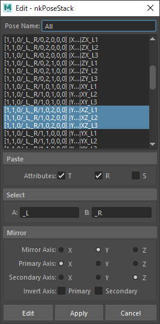
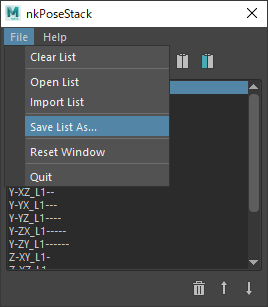

# nkPoseStack

[](https://github.com/imaoki/nkPoseStack/releases/latest)

ポーズをコピペするツール。


## 特徴

* 複数のポーズを登録可能

* ポーズは任意のノードに貼り付け可能

* ポーズのミラーリング

* 貼り付け設定はノード毎に設定可能

* 全ての回転順序に対応

* 置き換え文字を使用して反対側ノードを相互に選択可能

* ポーズのトランスフォームを後から更新可能

* ポーズリストの保存/読み込み

<!-- ## 要件 -->

<!-- * [imaoki/Standard](https://github.com/imaoki/Standard) -->

## 開発環境

Maya 2022.5 / Windows 10

## インストール

01. `nkPoseStackIcons`ディレクトリと`nkPoseStack.mel`をスクリプトディレクトリにコピー

    英語版
    :   `%MAYA_APP_DIR%\<version>\scripts`

    日本語版
    :   `%MAYA_APP_DIR%\<version>\ja_JP\scripts`

02. Mayaを再起動

## 起動方法

```mel
nkPoseStack;
```

## メインウィンドウ


| アイコン                                                                                                         | 名前                    | 機能                                               |
| ---------------------------------------------------------------------------------------------------------------- | ----------------------- | -------------------------------------------------- |
|                                                                        | `Add`                   | 選択ノードのポーズを作成する                       |
|                                                                     | `Edit`                  | ポーズの設定を編集する                             |
|                                                      | `Duplicate`             | ポーズを複製する                                   |
|                                                               | `Update`                | ポーズのトランスフォームを現在の状態に更新する     |
|                                               | `Select Source`         | ポーズのソースノードを選択する                     |
|                                         | `Select Opposite`       | ポーズの反対側ノードを選択する                     |
|                                                    | `As Is Paste`           | ポーズを現在選択しているノードにそのまま貼り付ける |
|                                                | `Mirror Paste`          | ポーズを現在選択しているノードにミラーリングする   |
|                                                               | `Delete`                | ポーズを削除する                                   |
|  | `Move Up` / `Move Down` | ポーズを並べ替える                                 |

## 編集ウィンドウ



### モード

編集ウィンドウには二つのモードがあります。

追加モード
:   メインウィンドウの`Add`ボタンを押すと現在選択しているノードを対象とした追加モードになります。

編集モード
:   メインウィンドウの`Edit`ボタンを押すと現在ポーズリストで選択しているポーズの編集モードになります。

### 設定方法

01. ノードリストで設定したいノードを選択します。（複数選択可）

02. `Paste`、`Select`、`Mirror`の項目をそれぞれ設定します。

03. `Add`または`Edit`、もしくは`Apply`を押してポーズを追加/更新します。

    * `Apply`ではウィンドウを閉じずに継続して編集が行えます。
      **ただし編集対象は逐一メインウィンドウの`Add`または`Edit`を押して適切なモードに切り替える必要があります。**

    * 最後に設定した値が次にポーズを追加する時の初期値になります。

### Paste

貼り付け先のアトリビュートを設定します。

### Select

反対側ノードを選択する際の置き換え文字を設定します。
`A`と`B`を双方向に参照するので左右混成のポーズでも適切に選択できます。

### Mirror

ミラーリングの軸を設定します。

| 項目             | 説明                           |
| ---------------- | ------------------------------ |
| `Mirror Axis`    | ミラー軸                       |
| `Primary Axis`   | 対称化する1番目の軸            |
| `Secondary Axis` | 対称化する2番目の軸            |
| `Invert Axis`    | 対称化した後で反転するかどうか |

## ポーズリストの保存/読み込み



ポーズリストを外部ファイルに保存できます。
拡張子は`.posestack`ですが中身はプレーンテキストです。

## 補足事項

* ポーズのコピーと貼り付けはノードの選択順に行われます。
  重要なのは選択順序のみです。

* ポーズのノード数と貼り付け先のノード数が合っている必要はありません。
  少ない方に合わせて貼り付けを行います。

* ポーズ名は重複可能です。

* いずれの入力欄でも以下の文字は使用できません。

  ```
  = ; [ ] / ,
  ```

<!-- ## 使い方 -->

<!-- ## 制限 -->

<!-- ## 既知の問題 -->

<!-- * 問題 -->

<!-- ## 追加情報 -->
