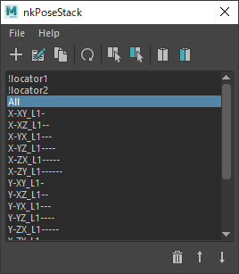

# nkPoseStack

[](https://github.com/imaoki/nkPoseStack/releases/latest)

ポーズをコピペするツール。

## 特徴



* 複数のポーズを登録可能。

* 置き換え文字を使用した反対側ノードの選択。

* ポーズのミラーリング。

  * 対称化するプライマリ軸とセカンダリ軸を個別に指定可能。

  * プライマリ軸とセカンダリ軸をそれぞれ反転可能。

  * 全てのロールオーダーに対応。

* 貼り付け先のアトリビュートやミラーリングの設定はノード毎に設定可能。

  

* 作成済みポーズのトランスフォームを後から更新可能。

* メインウィンドウはドッキング可能。

  

<!-- ## 要件 -->

<!-- * [imaoki/Standard](https://github.com/imaoki/Standard) -->

## 開発環境

Maya 2022.5 / Windows 10

## インストール

01. `nkPoseStackIcons`ディレクトリと`nkPoseStack.mel`をスクリプトディレクトリにコピー

    英語版
    : `%MAYA_APP_DIR%\<version>\scripts`

    日本語版
    : `%MAYA_APP_DIR%\<version>\ja_JP\scripts`

02. Mayaを再起動

## 起動方法

```mel
nkPoseStack;
```

## 使用上の注意点

* ポーズ名は重複可能です。

* いずれの入力欄でも以下の文字は使用できません。

  ```
  = ; [ ] / ,
  ```

* ポーズのコピーと貼り付けはノードの選択順に行われます。
  ノード名等は見ておらず選択順序のみが重要になります。
  `Select Source`、`Select Opposite`、手動選択等を適宜使い分けてください。

<!-- ## 使い方 -->

## 制限

* 現在のところ作成したポーズはMayaの起動中しか保持されません。

<!-- ## 既知の問題 -->

<!-- * 問題 -->

<!-- ## 追加情報 -->
